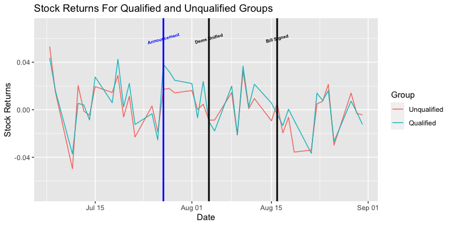
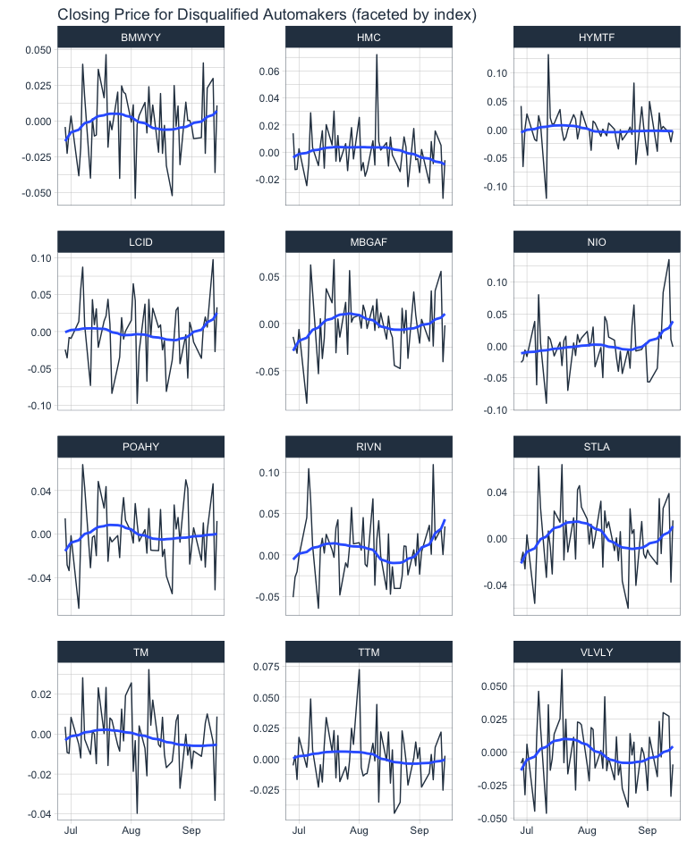
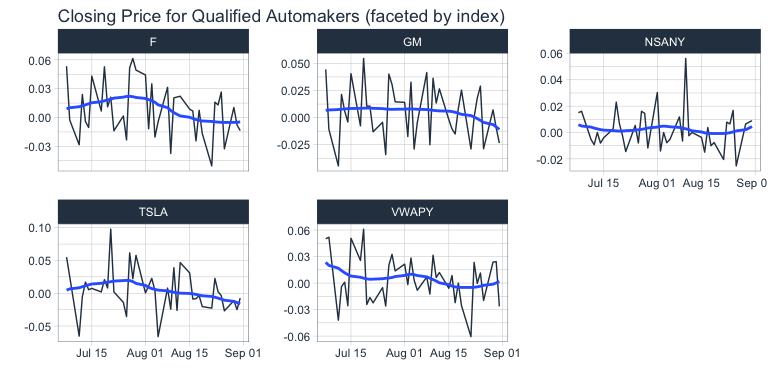
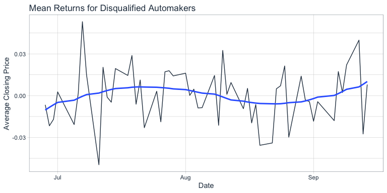
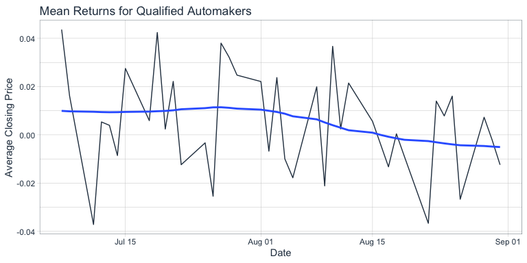

## Graph Comapring Stock Returns for Publically Traded Automakers by Grouping

## Diff-in-Diff Regression Output

    Call:
    lm(formula = Returns ~ Group + N15 + N14 + N13 + N12 + N11 + 
        N10 + N09 + N08 + N07 + N06 + N05 + N04 + N03 + N02 + N01 + 
        Event0 + P01 + P02 + P03 + P04 + P05 + P06 + P07 + Event1 + 
        P09 + P10 + P11 + P12 + P13 + P14 + P15 + Event2 + P17 + 
        P18 + P19 + P20 + P17 + P18 + P19 + P20 + P21 + P22 + P23 + 
        P24 + P25 + GroupxN15 + GroupxN14 + GroupxN13 + GroupxN12 + 
        GroupxN11 + GroupxN10 + GroupxN09 + GroupxN08 + GroupxN07 + 
        GroupxN06 + GroupxN05 + GroupxN04 + GroupxN03 + GroupxN02 + 
        GroupxN01 + GroupxEvent0 + GroupxP01 + GroupxP02 + GroupxP03 + 
        GroupxP04 + GroupxP05 + GroupxP06 + GroupxP07 + GroupxEvent1 + 
        GroupxP09 + GroupxP10 + GroupxP11 + GroupxP12 + GroupxP13 + 
        GroupxP14 + GroupxP15 + GroupxEvent2 + GroupxP17 + GroupxP18 + 
        GroupxP19 + GroupxP20 + GroupxP21 + GroupxP22 + GroupxP23 + 
        GroupxP24 + GroupxP25, data = master_df)

    Residuals:
          Min        1Q    Median        3Q       Max 
    -0.120688 -0.011177 -0.000242  0.012564  0.111193 

    Coefficients: (24 not defined because of singularities)
                   Estimate Std. Error t value Pr(>|t|)    
    (Intercept)  -0.0004797  0.0021288  -0.225  0.82179    
    Group1       -0.0004415  0.0039254  -0.112  0.91049    
    N15           0.0208486  0.0073746   2.827  0.00485 ** 
    N14          -0.0005904  0.0073746  -0.080  0.93622    
    N13          -0.0042086  0.0073746  -0.571  0.56841    
    N12           0.0199501  0.0073746   2.705  0.00701 ** 
    N11                  NA         NA      NA       NA    
    N10                  NA         NA      NA       NA    
    N09           0.0149930  0.0073746   2.033  0.04247 *  
    N08           0.0293280  0.0073746   3.977 7.81e-05 ***
    N07          -0.0056371  0.0073746  -0.764  0.44492    
    N06           0.0117352  0.0073746   1.591  0.11205    
    N05          -0.0225216  0.0073746  -3.054  0.00236 ** 
    N04                  NA         NA      NA       NA    
    N03                  NA         NA      NA       NA    
    N02           0.0036370  0.0073746   0.493  0.62206    
    N01          -0.0183170  0.0073746  -2.484  0.01326 *  
    Event0        0.0176226  0.0073746   2.390  0.01716 *  
    P01           0.0183845  0.0073746   2.493  0.01293 *  
    P02           0.0146609  0.0073746   1.988  0.04725 *  
    P03                  NA         NA      NA       NA    
    P04                  NA         NA      NA       NA    
    P05           0.0166226  0.0073746   2.254  0.02454 *  
    P06           0.0006772  0.0073746   0.092  0.92686    
    P07           0.0051376  0.0073746   0.697  0.48627    
    Event1       -0.0083280  0.0073746  -1.129  0.25921    
    P09          -0.0081689  0.0073746  -1.108  0.26841    
    P10                  NA         NA      NA       NA    
    P11                  NA         NA      NA       NA    
    P12           0.0149366  0.0073746   2.025  0.04325 *  
    P13          -0.0207868  0.0073746  -2.819  0.00498 ** 
    P14           0.0329565  0.0073746   4.469 9.35e-06 ***
    P15           0.0014163  0.0073746   0.192  0.84776    
    Event2        0.0099041  0.0073746   1.343  0.17976    
    P17                  NA         NA      NA       NA    
    P18                  NA         NA      NA       NA    
    P19          -0.0088532  0.0073746  -1.201  0.23040    
    P20           0.0057112  0.0073746   0.774  0.43896    
    P21          -0.0190869  0.0073746  -2.588  0.00987 ** 
    P22          -0.0058952  0.0073746  -0.799  0.42436    
    P23          -0.0351486  0.0073746  -4.766 2.34e-06 ***
    P24                  NA         NA      NA       NA    
    P25                  NA         NA      NA       NA    
    GroupxN15    -0.0145861  0.0135980  -1.073  0.28384    
    GroupxN14     0.0054515  0.0135980   0.401  0.68863    
    GroupxN13    -0.0034415  0.0135980  -0.253  0.80028    
    GroupxN12     0.0084731  0.0135980   0.623  0.53344    
    GroupxN11            NA         NA      NA       NA    
    GroupxN10            NA         NA      NA       NA    
    GroupxN09    -0.0081784  0.0135980  -0.601  0.54776    
    GroupxN08     0.0139892  0.0135980   1.029  0.30399    
    GroupxN07     0.0089569  0.0135980   0.659  0.51034    
    GroupxN06     0.0113268  0.0135980   0.833  0.40518    
    GroupxN05     0.0110741  0.0135980   0.814  0.41573    
    GroupxN04            NA         NA      NA       NA    
    GroupxN03            NA         NA      NA       NA    
    GroupxN02    -0.0060303  0.0135980  -0.443  0.65758    
    GroupxN01    -0.0061948  0.0135980  -0.456  0.64886    
    GroupxEvent0  0.0212928  0.0135980   1.566  0.11789    
    GroupxP01     0.0147577  0.0135980   1.085  0.27822    
    GroupxP02     0.0110012  0.0135980   0.809  0.41881    
    GroupxP03            NA         NA      NA       NA    
    GroupxP04            NA         NA      NA       NA    
    GroupxP05     0.0063866  0.0135980   0.470  0.63875    
    GroupxP06    -0.0065195  0.0135980  -0.479  0.63179    
    GroupxP07     0.0195051  0.0135980   1.434  0.15196    
    GroupxEvent1 -0.0006907  0.0135980  -0.051  0.95951    
    GroupxP09    -0.0086927  0.0135980  -0.639  0.52289    
    GroupxP10            NA         NA      NA       NA    
    GroupxP11            NA         NA      NA       NA    
    GroupxP12     0.0058748  0.0135980   0.432  0.66587    
    GroupxP13     0.0005589  0.0135980   0.041  0.96723    
    GroupxP14     0.0046300  0.0135980   0.340  0.73360    
    GroupxP15     0.0019721  0.0135980   0.145  0.88474    
    GroupxEvent2  0.0124775  0.0135980   0.918  0.35919    
    GroupxP17            NA         NA      NA       NA    
    GroupxP18            NA         NA      NA       NA    
    GroupxP19     0.0153700  0.0135980   1.130  0.25878    
    GroupxP20    -0.0085827  0.0135980  -0.631  0.52816    
    GroupxP21     0.0067580  0.0135980   0.497  0.61938    
    GroupxP22     0.0072239  0.0135980   0.531  0.59544    
    GroupxP23     0.0270916  0.0135980   1.992  0.04677 *  
    GroupxP24            NA         NA      NA       NA    
    GroupxP25            NA         NA      NA       NA    
    ---
    Signif. codes:  0 '***' 0.001 '**' 0.01 '*' 0.05 '.' 0.1 ' ' 1

    Residual standard error: 0.02446 on 620 degrees of freedom
    Multiple R-squared:  0.2838,    Adjusted R-squared:  0.2156 
    F-statistic: 4.164 on 59 and 620 DF,  p-value: < 2.2e-16

## More visualizations

