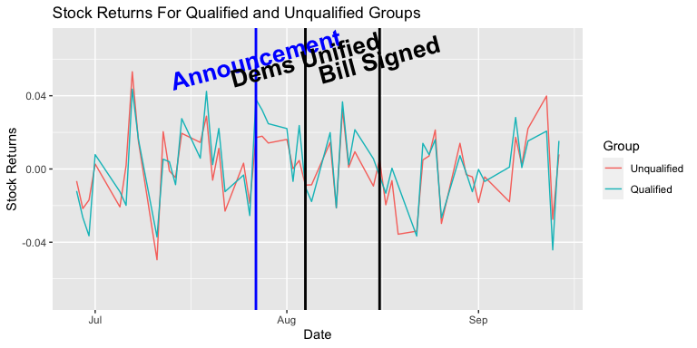
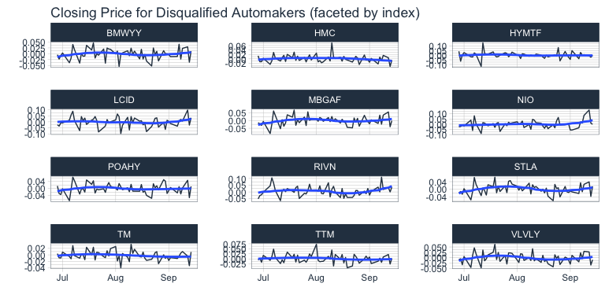
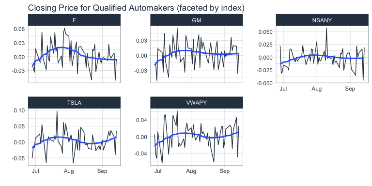
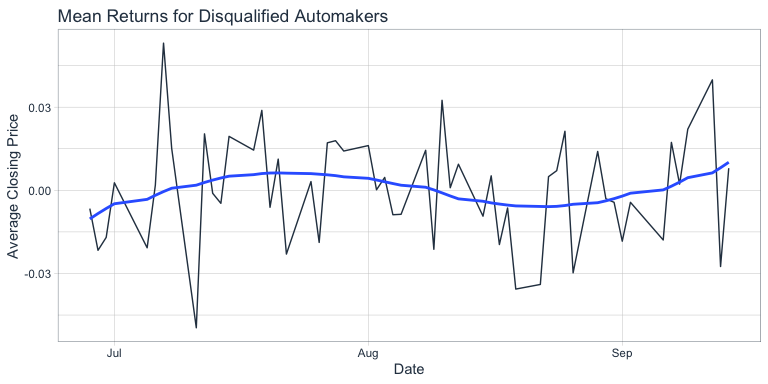
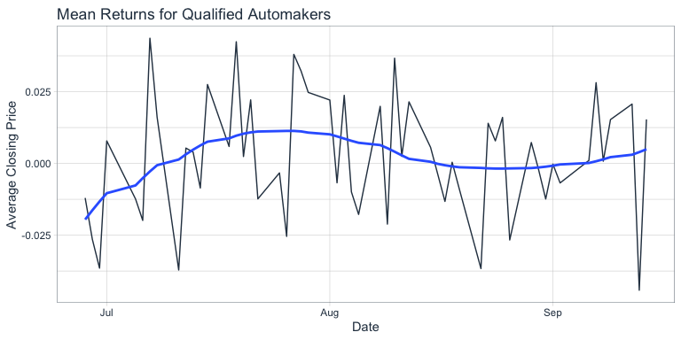

\#Notes \#Adjust this to a week: how to figure out the internal
\#Calculate the returns. Average and plot them on the same figure –&gt;
smoother in ggplot \#Instead of just before and after: dummies for each
day. Group, Each Day, Interaction between Group and Each Day
\#Calculating the difference between each graph on a daily basis \#Rerun
with three data points \#Start with daily one \#Ideally the stock
returns are flat before and then it jumps up in group 1 \#If its not
flat before…you worry its not a good control group \#Change the graph to
returns because closing price is misleading \#If you plot them together,
they should be on top of each other until the event \#Create 30 before
and after \#Consider changing the date to a day before if you think
there is an anticipate –&gt; if it is obvious in the data you can make
this case \#Group, 60 dummies, 60 dummies \* group interaction = 121

    Call:
    lm(formula = Returns ~ AfterEvent0 + Group + GroupxAfterEvent0 + 
        GroupxAfterEvent1 + GroupxAfterEvent2 + N30 + N29 + N28 + 
        N27 + N26 + N25 + N24 + N23 + N22 + N21 + N20 + N19 + N18 + 
        N17 + N16 + N15 + N14 + N13 + N12 + N11 + N10 + N09 + N08 + 
        N07 + N06 + N05 + N04 + N03 + N02 + N01 + Event0 + P01 + 
        P02 + P03 + P04 + P05 + P06 + P07 + Event1 + P09 + P10 + 
        P11 + P12 + P13 + P14 + P15 + Event2 + P17 + P18 + P19 + 
        P20 + P17 + P18 + P19 + P20 + P21 + P22 + P23 + P24 + P25 + 
        P26 + P27 + P28 + P29 + P30 + P31 + P32 + P33 + P34 + P35 + 
        P36 + P37 + P38 + P39 + P40 + P41 + P42 + P43 + P44 + P45 + 
        P46 + P47 + GroupxN30 + GroupxN29 + GroupxN28 + GroupxN27 + 
        GroupxN26 + GroupxN25 + GroupxN24 + GroupxN23 + GroupxN22 + 
        GroupxN21 + GroupxN20 + GroupxN19 + GroupxN18 + GroupxN17 + 
        GroupxN16 + GroupxN15 + GroupxN14 + GroupxN13 + GroupxN12 + 
        GroupxN11 + GroupxN10 + GroupxN09 + GroupxN08 + GroupxN07 + 
        GroupxN06 + GroupxN05 + GroupxN04 + GroupxN03 + GroupxN02 + 
        GroupxN01 + GroupxEvent0 + GroupxP01 + GroupxP02 + GroupxP03 + 
        GroupxP04 + GroupxP05 + GroupxP06 + GroupxP07 + GroupxEvent1 + 
        GroupxP09 + GroupxP10 + GroupxP11 + GroupxP12 + GroupxP13 + 
        GroupxP14 + GroupxP15 + GroupxEvent2 + GroupxP17 + GroupxP18 + 
        GroupxP19 + GroupxP20 + GroupxP21 + GroupxP22 + GroupxP23 + 
        GroupxP24 + GroupxP25 + GroupxP26 + GroupxP27 + GroupxP28 + 
        GroupxP29 + GroupxP30 + GroupxP31 + GroupxP32 + GroupxP33 + 
        GroupxP34 + GroupxP35 + GroupxP36 + GroupxP37 + GroupxP38 + 
        GroupxP39 + GroupxP40 + GroupxP41 + GroupxP42 + GroupxP43 + 
        GroupxP44 + GroupxP45 + GroupxP46 + GroupxP47, data = master_df)

    Residuals:
          Min        1Q    Median        3Q       Max 
    -0.088468 -0.011371 -0.000722  0.010381  0.111193 

    Coefficients: (54 not defined because of singularities)
                        Estimate Std. Error t value Pr(>|t|)    
    (Intercept)       -0.0187968  0.0062372  -3.014 0.002660 ** 
    AfterEvent0        0.0090425  0.0076390   1.184 0.236858    
    Group1            -0.0066362  0.0115008  -0.577 0.564082    
    GroupxAfterEvent0  0.0256998  0.0162647   1.580 0.114466    
    GroupxAfterEvent1 -0.0041351  0.0162647  -0.254 0.799373    
    GroupxAfterEvent2 -0.0196014  0.0140856  -1.392 0.164421    
    N30                       NA         NA      NA       NA    
    N29                0.0122041  0.0088207   1.384 0.166864    
    N28               -0.0028427  0.0088207  -0.322 0.747327    
    N27                0.0018141  0.0088207   0.206 0.837107    
    N26                0.0215184  0.0088207   2.440 0.014916 *  
    N25                       NA         NA      NA       NA    
    N24                       NA         NA      NA       NA    
    N23                       NA         NA      NA       NA    
    N22               -0.0019403  0.0088207  -0.220 0.825946    
    N21                0.0206478  0.0088207   2.341 0.019478 *  
    N20                0.0719005  0.0088207   8.151 1.33e-15 ***
    N19                0.0337325  0.0088207   3.824 0.000141 ***
    N18                       NA         NA      NA       NA    
    N17                       NA         NA      NA       NA    
    N16               -0.0307973  0.0088207  -3.491 0.000506 ***
    N15                0.0391657  0.0088207   4.440 1.02e-05 ***
    N14                0.0177266  0.0088207   2.010 0.044792 *  
    N13                0.0141084  0.0088207   1.599 0.110100    
    N12                0.0382672  0.0088207   4.338 1.61e-05 ***
    N11                       NA         NA      NA       NA    
    N10                       NA         NA      NA       NA    
    N09                0.0333101  0.0088207   3.776 0.000171 ***
    N08                0.0476450  0.0088207   5.401 8.65e-08 ***
    N07                0.0126799  0.0088207   1.438 0.150951    
    N06                0.0300522  0.0088207   3.407 0.000689 ***
    N05               -0.0042046  0.0088207  -0.477 0.633721    
    N04                       NA         NA      NA       NA    
    N03                       NA         NA      NA       NA    
    N02                0.0219541  0.0088207   2.489 0.013009 *  
    N01                       NA         NA      NA       NA    
    Event0             0.0268971  0.0076390   3.521 0.000453 ***
    P01                0.0276590  0.0076390   3.621 0.000312 ***
    P02                0.0239354  0.0076390   3.133 0.001789 ** 
    P03                       NA         NA      NA       NA    
    P04                       NA         NA      NA       NA    
    P05                0.0258971  0.0076390   3.390 0.000732 ***
    P06                0.0099517  0.0076390   1.303 0.193021    
    P07                0.0144121  0.0076390   1.887 0.059557 .  
    Event1             0.0009464  0.0076390   0.124 0.901427    
    P09                0.0011056  0.0076390   0.145 0.884959    
    P10                       NA         NA      NA       NA    
    P11                       NA         NA      NA       NA    
    P12                0.0242111  0.0076390   3.169 0.001584 ** 
    P13               -0.0115123  0.0076390  -1.507 0.132182    
    P14                0.0422310  0.0076390   5.528 4.34e-08 ***
    P15                0.0106908  0.0076390   1.400 0.162037    
    Event2             0.0191785  0.0076390   2.511 0.012242 *  
    P17                       NA         NA      NA       NA    
    P18                       NA         NA      NA       NA    
    P19                0.0004213  0.0076390   0.055 0.956030    
    P20                0.0149857  0.0076390   1.962 0.050128 .  
    P21               -0.0098124  0.0076390  -1.285 0.199321    
    P22                0.0033793  0.0076390   0.442 0.658336    
    P23               -0.0258741  0.0076390  -3.387 0.000740 ***
    P24                       NA         NA      NA       NA    
    P25                       NA         NA      NA       NA    
    P26               -0.0242076  0.0076390  -3.169 0.001586 ** 
    P27                0.0146930  0.0076390   1.923 0.054770 .  
    P28                0.0168503  0.0076390   2.206 0.027670 *  
    P29                0.0310678  0.0076390   4.067 5.22e-05 ***
    P30               -0.0200154  0.0076390  -2.620 0.008950 ** 
    P31                       NA         NA      NA       NA    
    P32                       NA         NA      NA       NA    
    P33                0.0237809  0.0076390   3.113 0.001915 ** 
    P34                0.0067109  0.0076390   0.879 0.379925    
    P35                0.0054316  0.0076390   0.711 0.477258    
    P36               -0.0086041  0.0076390  -1.126 0.260349    
    P37                0.0054256  0.0076390   0.710 0.477748    
    P38                       NA         NA      NA       NA    
    P39                       NA         NA      NA       NA    
    P40                       NA         NA      NA       NA    
    P41               -0.0081622  0.0076390  -1.068 0.285609    
    P42                0.0270501  0.0076390   3.541 0.000421 ***
    P43                0.0119944  0.0076390   1.570 0.116762    
    P44                0.0318212  0.0076390   4.166 3.43e-05 ***
    P45                       NA         NA      NA       NA    
    P46                       NA         NA      NA       NA    
    P47                0.0496155  0.0076390   6.495 1.43e-10 ***
    GroupxN30                 NA         NA      NA       NA    
    GroupxN29          0.0011947  0.0162647   0.073 0.941465    
    GroupxN28          0.0018104  0.0162647   0.111 0.911399    
    GroupxN27         -0.0128837  0.0162647  -0.792 0.428512    
    GroupxN26          0.0117600  0.0162647   0.723 0.469858    
    GroupxN25                 NA         NA      NA       NA    
    GroupxN24                 NA         NA      NA       NA    
    GroupxN23                 NA         NA      NA       NA    
    GroupxN22          0.0149797  0.0162647   0.921 0.357321    
    GroupxN21         -0.0150875  0.0162647  -0.928 0.353872    
    GroupxN20         -0.0028387  0.0162647  -0.175 0.861490    
    GroupxN19          0.0077427  0.0162647   0.476 0.634169    
    GroupxN18                 NA         NA      NA       NA    
    GroupxN17                 NA         NA      NA       NA    
    GroupxN16          0.0190817  0.0162647   1.173 0.241052    
    GroupxN15         -0.0083913  0.0162647  -0.516 0.606045    
    GroupxN14          0.0116462  0.0162647   0.716 0.474165    
    GroupxN13          0.0027532  0.0162647   0.169 0.865621    
    GroupxN12          0.0146678  0.0162647   0.902 0.367414    
    GroupxN11                 NA         NA      NA       NA    
    GroupxN10                 NA         NA      NA       NA    
    GroupxN09         -0.0019837  0.0162647  -0.122 0.902958    
    GroupxN08          0.0201840  0.0162647   1.241 0.214968    
    GroupxN07          0.0151516  0.0162647   0.932 0.351832    
    GroupxN06          0.0175215  0.0162647   1.077 0.281671    
    GroupxN05          0.0172689  0.0162647   1.062 0.288662    
    GroupxN04                 NA         NA      NA       NA    
    GroupxN03                 NA         NA      NA       NA    
    GroupxN02          0.0001644  0.0162647   0.010 0.991936    
    GroupxN01                 NA         NA      NA       NA    
    GroupxEvent0       0.0017878  0.0162647   0.110 0.912502    
    GroupxP01         -0.0047474  0.0162647  -0.292 0.770449    
    GroupxP02         -0.0085039  0.0162647  -0.523 0.601223    
    GroupxP03                 NA         NA      NA       NA    
    GroupxP04                 NA         NA      NA       NA    
    GroupxP05         -0.0131184  0.0162647  -0.807 0.420151    
    GroupxP06         -0.0260246  0.0162647  -1.600 0.109965    
    GroupxP07                 NA         NA      NA       NA    
    GroupxEvent1      -0.0160606  0.0162647  -0.987 0.323709    
    GroupxP09         -0.0240626  0.0162647  -1.479 0.139403    
    GroupxP10                 NA         NA      NA       NA    
    GroupxP11                 NA         NA      NA       NA    
    GroupxP12         -0.0094952  0.0162647  -0.584 0.559520    
    GroupxP13         -0.0148111  0.0162647  -0.911 0.362756    
    GroupxP14         -0.0107400  0.0162647  -0.660 0.509227    
    GroupxP15         -0.0133979  0.0162647  -0.824 0.410323    
    GroupxEvent2      -0.0028925  0.0162647  -0.178 0.858894    
    GroupxP17                 NA         NA      NA       NA    
    GroupxP18                 NA         NA      NA       NA    
    GroupxP19                 NA         NA      NA       NA    
    GroupxP20         -0.0043513  0.0140856  -0.309 0.757460    
    GroupxP21          0.0109894  0.0140856   0.780 0.435504    
    GroupxP22          0.0114553  0.0140856   0.813 0.416300    
    GroupxP23          0.0313230  0.0140856   2.224 0.026434 *  
    GroupxP24                 NA         NA      NA       NA    
    GroupxP25                 NA         NA      NA       NA    
    GroupxP26          0.0019870  0.0140856   0.141 0.887850    
    GroupxP27          0.0137178  0.0140856   0.974 0.330396    
    GroupxP28          0.0054281  0.0140856   0.385 0.700066    
    GroupxP29         -0.0006037  0.0140856  -0.043 0.965823    
    GroupxP30          0.0077568  0.0140856   0.551 0.581997    
    GroupxP31                 NA         NA      NA       NA    
    GroupxP32                 NA         NA      NA       NA    
    GroupxP33         -0.0020730  0.0140856  -0.147 0.883032    
    GroupxP34          0.0056495  0.0140856   0.401 0.688462    
    GroupxP35         -0.0034127  0.0140856  -0.242 0.808620    
    GroupxP36          0.0227694  0.0140856   1.616 0.106368    
    GroupxP37          0.0021931  0.0140856   0.156 0.876311    
    GroupxP38                 NA         NA      NA       NA    
    GroupxP39                 NA         NA      NA       NA    
    GroupxP40                 NA         NA      NA       NA    
    GroupxP41          0.0236176  0.0140856   1.677 0.093975 .  
    GroupxP42          0.0155172  0.0140856   1.102 0.270941    
    GroupxP43          0.0032043  0.0140856   0.227 0.820103    
    GroupxP44         -0.0021214  0.0140856  -0.151 0.880323    
    GroupxP45                 NA         NA      NA       NA    
    GroupxP46                 NA         NA      NA       NA    
    GroupxP47         -0.0145150  0.0140856  -1.030 0.303083    
    ---
    Signif. codes:  0 '***' 0.001 '**' 0.01 '*' 0.05 '.' 0.1 ' ' 1

    Residual standard error: 0.02161 on 827 degrees of freedom
    Multiple R-squared:  0.4818,    Adjusted R-squared:  0.4147 
    F-statistic: 7.185 on 107 and 827 DF,  p-value: < 2.2e-16

