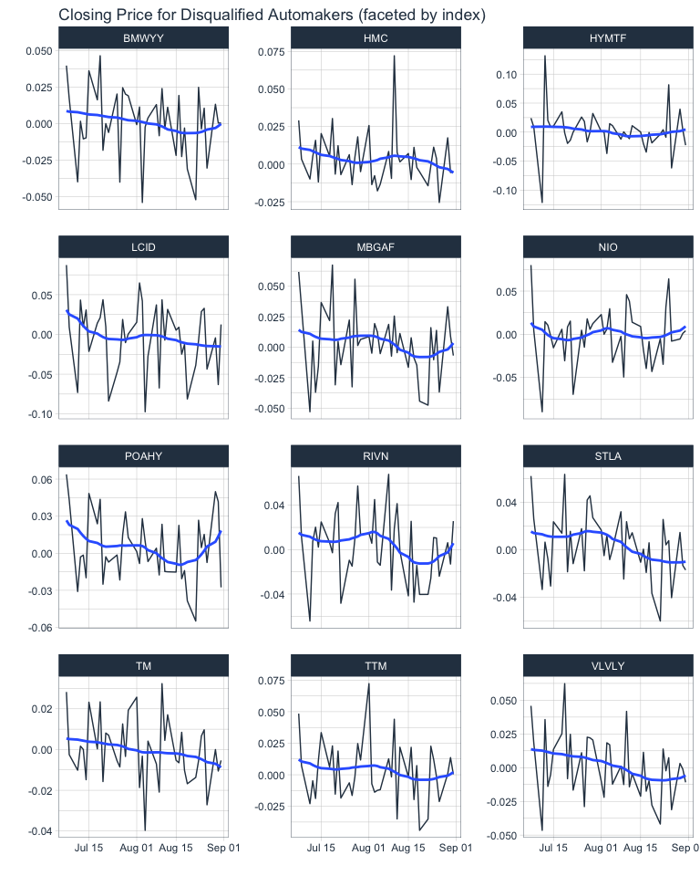
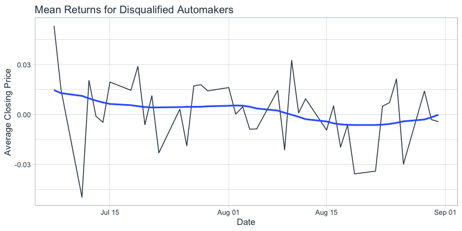

## Graph Comapring Stock Returns for Publically Traded Automakers by Grouping

## Diff-in-Diff Regression Output

    Call:
    lm(formula = Returns ~ Group + N30 + N29 + N28 + N27 + N26 + 
        N25 + N24 + N23 + N22 + N21 + N20 + N19 + N18 + N17 + N16 + 
        N15 + N14 + N13 + N12 + N11 + N10 + N09 + N08 + N07 + N06 + 
        N05 + N04 + N03 + N02 + N01 + Event0 + P01 + P02 + P03 + 
        P04 + P05 + P06 + P07 + Event1 + P09 + P10 + P11 + P12 + 
        P13 + P14 + P15 + Event2 + P17 + P18 + P19 + P20 + P17 + 
        P18 + P19 + P20 + P21 + P22 + P23 + P24 + P25 + P26 + P27 + 
        P28 + P29 + P30 + P31 + P32 + P33 + P34 + P35 + P36 + P37 + 
        P38 + P39 + P40 + P41 + P42 + P43 + P44 + P45 + P46 + P47 + 
        GroupxN30 + GroupxN29 + GroupxN28 + GroupxN27 + GroupxN26 + 
        GroupxN25 + GroupxN24 + GroupxN23 + GroupxN22 + GroupxN21 + 
        GroupxN20 + GroupxN19 + GroupxN18 + GroupxN17 + GroupxN16 + 
        GroupxN15 + GroupxN14 + GroupxN13 + GroupxN12 + GroupxN11 + 
        GroupxN10 + GroupxN09 + GroupxN08 + GroupxN07 + GroupxN06 + 
        GroupxN05 + GroupxN04 + GroupxN03 + GroupxN02 + GroupxN01 + 
        GroupxEvent0 + GroupxP01 + GroupxP02 + GroupxP03 + GroupxP04 + 
        GroupxP05 + GroupxP06 + GroupxP07 + GroupxEvent1 + GroupxP09 + 
        GroupxP10 + GroupxP11 + GroupxP12 + GroupxP13 + GroupxP14 + 
        GroupxP15 + GroupxEvent2 + GroupxP17 + GroupxP18 + GroupxP19 + 
        GroupxP20 + GroupxP21 + GroupxP22 + GroupxP23 + GroupxP24 + 
        GroupxP25 + GroupxP26 + GroupxP27 + GroupxP28 + GroupxP29 + 
        GroupxP30 + GroupxP31 + GroupxP32 + GroupxP33 + GroupxP34 + 
        GroupxP35 + GroupxP36 + GroupxP37 + GroupxP38 + GroupxP39 + 
        GroupxP40 + GroupxP41 + GroupxP42 + GroupxP43 + GroupxP44 + 
        GroupxP45 + GroupxP46 + GroupxP47, data = master_df)

    Residuals:
          Min        1Q    Median        3Q       Max 
    -0.088468 -0.011371 -0.000722  0.010381  0.111193 

    Coefficients: (50 not defined because of singularities)
                   Estimate Std. Error t value Pr(>|t|)    
    (Intercept)  -0.0097542  0.0044104  -2.212 0.027263 *  
    Group1       -0.0046729  0.0081323  -0.575 0.565713    
    N30                  NA         NA      NA       NA    
    N29           0.0031616  0.0076390   0.414 0.679076    
    N28          -0.0118852  0.0076390  -1.556 0.120123    
    N27          -0.0072285  0.0076390  -0.946 0.344292    
    N26           0.0124759  0.0076390   1.633 0.102811    
    N25                  NA         NA      NA       NA    
    N24                  NA         NA      NA       NA    
    N23                  NA         NA      NA       NA    
    N22          -0.0109829  0.0076390  -1.438 0.150886    
    N21           0.0116052  0.0076390   1.519 0.129092    
    N20           0.0628579  0.0076390   8.229 7.34e-16 ***
    N19           0.0246899  0.0076390   3.232 0.001278 ** 
    N18                  NA         NA      NA       NA    
    N17                  NA         NA      NA       NA    
    N16          -0.0398399  0.0076390  -5.215 2.32e-07 ***
    N15           0.0301231  0.0076390   3.943 8.72e-05 ***
    N14           0.0086841  0.0076390   1.137 0.255947    
    N13           0.0050659  0.0076390   0.663 0.507411    
    N12           0.0292246  0.0076390   3.826 0.000140 ***
    N11                  NA         NA      NA       NA    
    N10                  NA         NA      NA       NA    
    N09           0.0242675  0.0076390   3.177 0.001544 ** 
    N08           0.0386025  0.0076390   5.053 5.35e-07 ***
    N07           0.0036374  0.0076390   0.476 0.634086    
    N06           0.0210097  0.0076390   2.750 0.006084 ** 
    N05          -0.0132472  0.0076390  -1.734 0.083264 .  
    N04                  NA         NA      NA       NA    
    N03                  NA         NA      NA       NA    
    N02           0.0129115  0.0076390   1.690 0.091364 .  
    N01          -0.0090425  0.0076390  -1.184 0.236858    
    Event0        0.0268971  0.0076390   3.521 0.000453 ***
    P01           0.0276590  0.0076390   3.621 0.000312 ***
    P02           0.0239354  0.0076390   3.133 0.001789 ** 
    P03                  NA         NA      NA       NA    
    P04                  NA         NA      NA       NA    
    P05           0.0258971  0.0076390   3.390 0.000732 ***
    P06           0.0099517  0.0076390   1.303 0.193021    
    P07           0.0144121  0.0076390   1.887 0.059557 .  
    Event1        0.0009464  0.0076390   0.124 0.901427    
    P09           0.0011056  0.0076390   0.145 0.884959    
    P10                  NA         NA      NA       NA    
    P11                  NA         NA      NA       NA    
    P12           0.0242111  0.0076390   3.169 0.001584 ** 
    P13          -0.0115123  0.0076390  -1.507 0.132182    
    P14           0.0422310  0.0076390   5.528 4.34e-08 ***
    P15           0.0106908  0.0076390   1.400 0.162037    
    Event2        0.0191785  0.0076390   2.511 0.012242 *  
    P17                  NA         NA      NA       NA    
    P18                  NA         NA      NA       NA    
    P19           0.0004213  0.0076390   0.055 0.956030    
    P20           0.0149857  0.0076390   1.962 0.050128 .  
    P21          -0.0098124  0.0076390  -1.285 0.199321    
    P22           0.0033793  0.0076390   0.442 0.658336    
    P23          -0.0258741  0.0076390  -3.387 0.000740 ***
    P24                  NA         NA      NA       NA    
    P25                  NA         NA      NA       NA    
    P26          -0.0242076  0.0076390  -3.169 0.001586 ** 
    P27           0.0146930  0.0076390   1.923 0.054770 .  
    P28           0.0168503  0.0076390   2.206 0.027670 *  
    P29           0.0310678  0.0076390   4.067 5.22e-05 ***
    P30          -0.0200154  0.0076390  -2.620 0.008950 ** 
    P31                  NA         NA      NA       NA    
    P32                  NA         NA      NA       NA    
    P33           0.0237809  0.0076390   3.113 0.001915 ** 
    P34           0.0067109  0.0076390   0.879 0.379925    
    P35           0.0054316  0.0076390   0.711 0.477258    
    P36          -0.0086041  0.0076390  -1.126 0.260349    
    P37           0.0054256  0.0076390   0.710 0.477748    
    P38                  NA         NA      NA       NA    
    P39                  NA         NA      NA       NA    
    P40                  NA         NA      NA       NA    
    P41          -0.0081622  0.0076390  -1.068 0.285609    
    P42           0.0270501  0.0076390   3.541 0.000421 ***
    P43           0.0119944  0.0076390   1.570 0.116762    
    P44           0.0318212  0.0076390   4.166 3.43e-05 ***
    P45                  NA         NA      NA       NA    
    P46                  NA         NA      NA       NA    
    P47           0.0496155  0.0076390   6.495 1.43e-10 ***
    GroupxN30            NA         NA      NA       NA    
    GroupxN29    -0.0007687  0.0140856  -0.055 0.956492    
    GroupxN28    -0.0001530  0.0140856  -0.011 0.991339    
    GroupxN27    -0.0148471  0.0140856  -1.054 0.292164    
    GroupxN26     0.0097967  0.0140856   0.696 0.486930    
    GroupxN25            NA         NA      NA       NA    
    GroupxN24            NA         NA      NA       NA    
    GroupxN23            NA         NA      NA       NA    
    GroupxN22     0.0130163  0.0140856   0.924 0.355710    
    GroupxN21    -0.0170509  0.0140856  -1.211 0.226427    
    GroupxN20    -0.0048021  0.0140856  -0.341 0.733251    
    GroupxN19     0.0057793  0.0140856   0.410 0.681692    
    GroupxN18            NA         NA      NA       NA    
    GroupxN17            NA         NA      NA       NA    
    GroupxN16     0.0171184  0.0140856   1.215 0.224594    
    GroupxN15    -0.0103547  0.0140856  -0.735 0.462471    
    GroupxN14     0.0096829  0.0140856   0.687 0.492003    
    GroupxN13     0.0007899  0.0140856   0.056 0.955295    
    GroupxN12     0.0127045  0.0140856   0.902 0.367347    
    GroupxN11            NA         NA      NA       NA    
    GroupxN10            NA         NA      NA       NA    
    GroupxN09    -0.0039470  0.0140856  -0.280 0.779380    
    GroupxN08     0.0182206  0.0140856   1.294 0.196177    
    GroupxN07     0.0131883  0.0140856   0.936 0.349395    
    GroupxN06     0.0155582  0.0140856   1.105 0.269678    
    GroupxN05     0.0153055  0.0140856   1.087 0.277526    
    GroupxN04            NA         NA      NA       NA    
    GroupxN03            NA         NA      NA       NA    
    GroupxN02    -0.0017989  0.0140856  -0.128 0.898407    
    GroupxN01    -0.0019633  0.0140856  -0.139 0.889178    
    GroupxEvent0  0.0255243  0.0140856   1.812 0.070336 .  
    GroupxP01     0.0189891  0.0140856   1.348 0.177988    
    GroupxP02     0.0152326  0.0140856   1.081 0.279821    
    GroupxP03            NA         NA      NA       NA    
    GroupxP04            NA         NA      NA       NA    
    GroupxP05     0.0106181  0.0140856   0.754 0.451170    
    GroupxP06    -0.0022881  0.0140856  -0.162 0.870997    
    GroupxP07     0.0237365  0.0140856   1.685 0.092335 .  
    GroupxEvent1  0.0035408  0.0140856   0.251 0.801587    
    GroupxP09    -0.0044613  0.0140856  -0.317 0.751532    
    GroupxP10            NA         NA      NA       NA    
    GroupxP11            NA         NA      NA       NA    
    GroupxP12     0.0101062  0.0140856   0.717 0.473278    
    GroupxP13     0.0047903  0.0140856   0.340 0.733879    
    GroupxP14     0.0088614  0.0140856   0.629 0.529452    
    GroupxP15     0.0062035  0.0140856   0.440 0.659754    
    GroupxEvent2  0.0167089  0.0140856   1.186 0.235868    
    GroupxP17            NA         NA      NA       NA    
    GroupxP18            NA         NA      NA       NA    
    GroupxP19     0.0196014  0.0140856   1.392 0.164421    
    GroupxP20    -0.0043513  0.0140856  -0.309 0.757460    
    GroupxP21     0.0109894  0.0140856   0.780 0.435504    
    GroupxP22     0.0114553  0.0140856   0.813 0.416300    
    GroupxP23     0.0313230  0.0140856   2.224 0.026434 *  
    GroupxP24            NA         NA      NA       NA    
    GroupxP25            NA         NA      NA       NA    
    GroupxP26     0.0019870  0.0140856   0.141 0.887850    
    GroupxP27     0.0137178  0.0140856   0.974 0.330396    
    GroupxP28     0.0054281  0.0140856   0.385 0.700066    
    GroupxP29    -0.0006037  0.0140856  -0.043 0.965823    
    GroupxP30     0.0077568  0.0140856   0.551 0.581997    
    GroupxP31            NA         NA      NA       NA    
    GroupxP32            NA         NA      NA       NA    
    GroupxP33    -0.0020730  0.0140856  -0.147 0.883032    
    GroupxP34     0.0056495  0.0140856   0.401 0.688462    
    GroupxP35    -0.0034127  0.0140856  -0.242 0.808620    
    GroupxP36     0.0227694  0.0140856   1.616 0.106368    
    GroupxP37     0.0021931  0.0140856   0.156 0.876311    
    GroupxP38            NA         NA      NA       NA    
    GroupxP39            NA         NA      NA       NA    
    GroupxP40            NA         NA      NA       NA    
    GroupxP41     0.0236176  0.0140856   1.677 0.093975 .  
    GroupxP42     0.0155172  0.0140856   1.102 0.270941    
    GroupxP43     0.0032043  0.0140856   0.227 0.820103    
    GroupxP44    -0.0021214  0.0140856  -0.151 0.880323    
    GroupxP45            NA         NA      NA       NA    
    GroupxP46            NA         NA      NA       NA    
    GroupxP47    -0.0145150  0.0140856  -1.030 0.303083    
    ---
    Signif. codes:  0 '***' 0.001 '**' 0.01 '*' 0.05 '.' 0.1 ' ' 1

    Residual standard error: 0.02161 on 827 degrees of freedom
    Multiple R-squared:  0.4818,    Adjusted R-squared:  0.4147 
    F-statistic: 7.185 on 107 and 827 DF,  p-value: < 2.2e-16

## More visualizations

